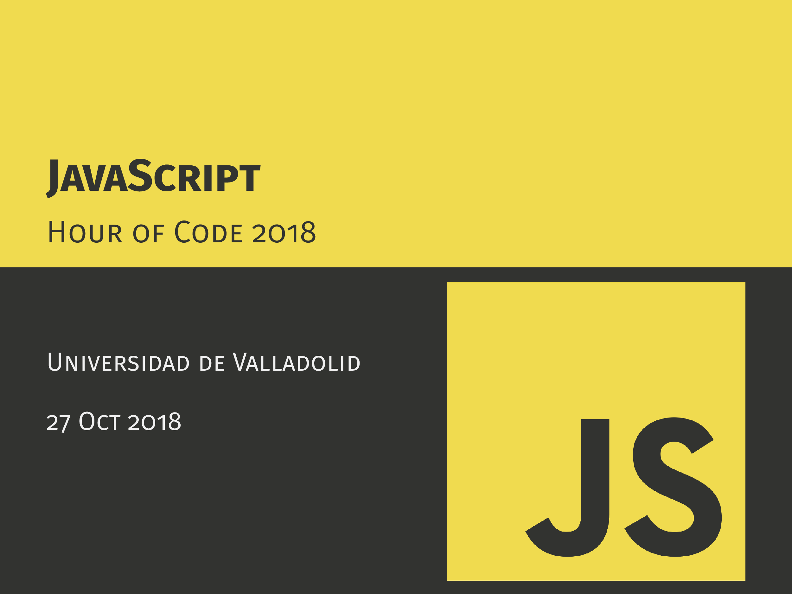

# Hour of Code 2018: JavaScript & TypeScript

## Introducción
Taller de iniciación a JavaScript y TypeScript para el Hour of Code 2018, organizado en la Universidad de Valladolid.

[Link a la pagina del evento en la UVa](http://eventos.uva.es/27587/detail/la-hora-del-codigo-2018.html)

## Links útiles

- [The Developer Roadmap 2018](https://github.com/kamranahmedse/developer-roadmap)
- [Learn HTML and CSS](https://learn.shayhowe.com/)
- [The Web Developer Bootcamp](https://www.udemy.com/the-web-developer-bootcamp/) (Suele estar de oferta por 10€)
- [Watch and Code: Practical Javascript course](https://watchandcode.com/p/practical-javascript)
- [React vs Vue vs Angular](https://medium.com/@TechMagic/reactjs-vs-angular5-vs-vue-js-what-to-choose-in-2018-b91e028fa91d)
- [TypeScript documentation](https://www.typescriptlang.org/docs/home.html)
- [JQFundamentals: Learn QJuery](http://jqfundamentals.com/)
- [What's frontend and backend](https://blog.teamtreehouse.com/i-dont-speak-your-language-frontend-vs-backend)
- [Node.js tutorial playlist by The Net Ninja](https://www.youtube.com/watch?v=w-7RQ46RgxU&list=PL4cUxeGkcC9gcy9lrvMJ75z9maRw4byYp)

## Créditos

- Carlos Gómez ([@Kurolox](https://github.com/Kurolox))
- Pablo Valdunciel ([@pabvald](https://github.com/pabvald))
